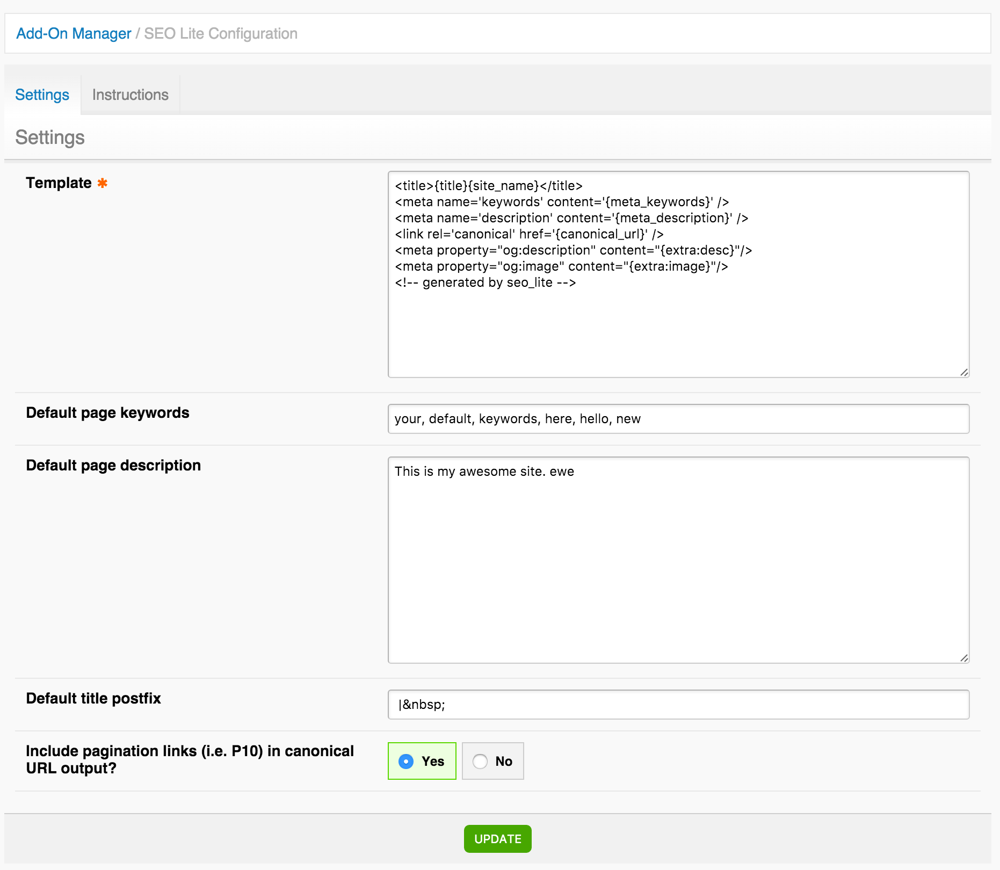

Most of the settings are set in the CP, but there are also some configuration options available that you specify in the config file.

## Control Panel

SEO Lite has a settings panel in the Control Panel. Navigate to the list of addons and click SEO Lite to access the settings.



Here you'll specify the default values for SEO Lite. Most of these are pretty self-explanatory.

### Template

This is the template that SEO Lite will output on each page where you put the SEO Lite tag.

The default template looks like this:

```html
<title>{title}{site_name}</title>
<meta name='keywords' content='{meta_keywords}' />
<meta name='description' content='{meta_description}' />
<link rel='canonical' href='{canonical_url}' />
<!-- generated by seo_lite -->
```

The SEO Lite template contains most global variables available in standard EE templates.

For example, you can use the segment variables (note how to do conditionals here):

```html
<title>{site_name} - {if segment_2 != ''}{segment_2} - {/if}{title}</title>
```

In addition you can pull in additional values from custom fields from your field groups using [Extra Tags](/seo-lite/extra-tags).

Here's an example of setting Facebook's OpenGraph tags (og:image and og:description) in the template:

```html
<meta property="og:title" content="{title}"/>
<meta property="og:description" content="{extra:desc}"/>
<meta property="og:image" content="{extra:image}"/>
```
.. and here's a complete, more advanced example of a site where og:image is set static in the template for the main page and then pulled out from the entry on all the subpages:

```html
<title>{title}{site_name}</title>
<meta name='keywords' content='{meta_keywords}' />
<meta name='description' content='{meta_description}' />
<link rel='canonical' href='{canonical_url}' />
<meta property="og:url" content="{canonical_url}"/>
{if segment_1 == ''}
<meta property="og:title" content="{site_name}"/>
<meta property="og:description" content="{meta_description}"/>
<meta property="og:image" content="http://example.com/fb_share.jpg"/>
{if:else}
<meta property="og:title" content="{entry_title}"/>
<meta property="og:description" content="{extra:desc}"/>
<meta property="og:image" content="{extra:image}"/>
{/if}
```

>>> A note about **{canonical_url}**; SEO Lite supports the "canonical" meta tag to specify the canonical URL. For advanced users the [ignore_last_segments](/seo-lite/tags#parameters) parameter can be used to specify that the X last segments should be ignored when it comes to the canonical url. A use case here is e.g. an URL which contain a sort parameter, e.g. http://example.com/cars/listings/sort/asc <- you would not want sort/asc to be part of the canonical url so in this case you'd specify ignore_last_segments="2". Note that this parameter also affects entry lookup when you use the use_last_segment="yes".


### Default page keywords

In this field you specify the default keywords you want SEO Lite to use if no entry is associated with the current page. Ie. this may be on the homepage if you have no channel entry associated with it.

### Default page description

This field contains the default description to use when SEO Lite can't find an entry associated with the current page (ie. the homepage).

### Default title postfix

Whatever specified here will be output after the {title} in the template.

For example, with the default setting (` |&nbsp;`) and an entry with the title "What I Discovered In Vegas" and `<title>{title}{site_name}</title>` (in the [SEO Lite Template](/seo-lite/configuration#template)) and {site_name} "Travis' Travel Blog" would output **What I Discovered in Vegas | Travis' Travel Blog** for that specific entry.

Note that the `&nbsp;` is required because we want a space on both sides of the pipe (|). There's a quirk in EE's template engine that will delete a space at the end of a parameter (but not at the start) so to prevent the space at the end from being deleted we encode it like that.

### Include pagination links in the canonical URL?

This is a yes or no setting. It's a personal choice; do you want the pagination pages indexed or the search engine to point to the main listing page?

ExpressionEngine will produce pagination links, ie. /houses/P10, /houses/P20, etc. These can be indexed, or the only main "houses" page can be indexed. If you only want the main /houses/ indexed, you set this setting to "No".


## Config file settings

In **/system/user/config/config.php** you can specify these settings for SEO Lite:

`$config['seolite_tab_title'] = 'SEO';` - specifices the title of the Publish Tab (default: SEO Lite)

`$config['seolite_show_keywords_field'] = 'n';` - set this to 'n' to hide they keywords field from the Publish Tab.

`$config['seolite_extra'] = array();` - Pull in additional info for SEO Lite (see [Extra Tags](/seo-lite/extra-tags) for more info)
