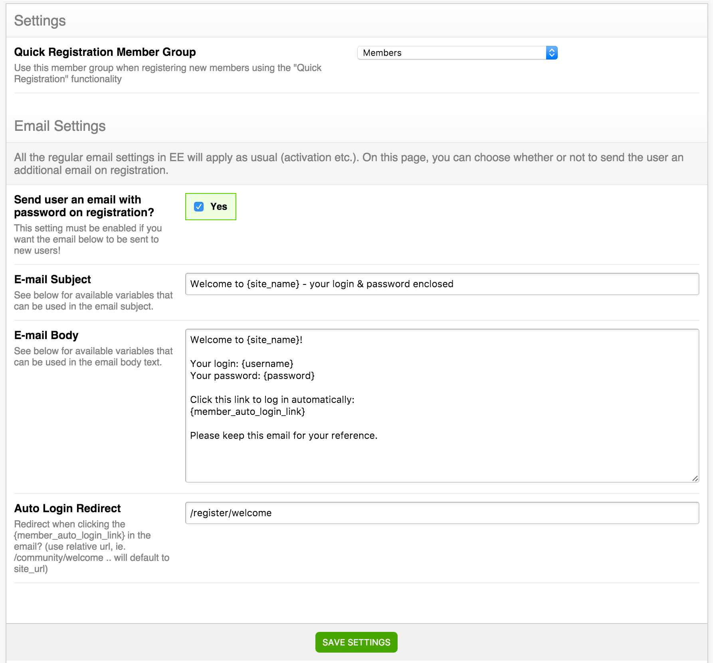

## General & Email Settings



### Quick Registration Member Group

Here you select the member group to use with the [Quick Registration](/simple-registration/quick-registration) functionality in the control panel.

If you do not select a member group here, you'll get a member group dropdown where you specify the member group when registering each member.

### Send user an email on registration??

Yes/No.

If enabled Simple Registration will send an email to the newly registered member. 

>>> Note, if you have set up ExpressionEngine to send out an **activation link on registration** that email will be sent in addition to the one sent by Simple Registration. If you want only one email to be sent out, the one from Simple Registration, you can set up EE to auto-activate, or manual activation.

### Email Subject

This field contains the template to use for the Email Subject. See available variables below.

### Email Body

This field contains the template to use for the Email Body. See available variables below.

### Available Email Variables

These variables may be used both in the [Email Subject](/simple-registration/configuration/settings#email-subject) and the [Email Body](/simple-registration/configuration/settings#email-body) template.

**User Specific Variables:**

| User Variable          | Description |
| ----------------- | ----------- |
| {member_id}       | The member_id of the user being emailed |
| {screen_name}     | The Screen Name of the user being emailed |
| {username}        | The Username of the user being emailed |
| {email}           | The Email of the user being emailed |
| {password}        | The Password generated for the newly registered user |
| {ip_address}      | The IP Address of the computer that performed the registration (useful for those "Ignore this email if that wasn't you" notices) |
| {group_id}        | The member group id of the user being emailed |
| {join_date}       | The date/time the registration was perfoemd |
| {member_auto_login_link} | A link the user can use to log in automatically (clicking it in the email will log the user in) |

>>> **{password}** will only work if you're using the auto-password generation feature. Because; security. We don't want to send out user-chosen passwords via email.

**Site Specific Variables:**

| Site Variable          | Description |
| ----------------- | ----------- |
| {site_name}       | The website name (specified in EE's settings) |
| {site_url}        | The website URL (specified in EE's settings) |
| {webmaster_email} | The email of the webmaster (specified in EE's settings) |


>>>> If you do chose to send out a **{member_auto_login_link}** or **{password}** in the email to new users, please consider the security implications of this; the email will pass several servers during its travel through the internet, and any of these can 'read it', and thus get access to the password / login link.


### Auto Login Redirect

Here you can specify the **relative URL** the user should be sent to when clicking the **{member_auto_login_link}** in the email. If none is specified, they will just be redirected to the homepage.

This can be useful if you want to send the user to a welcome page or something like that on their first login / visit to the site.

### Enable/Disable CAPTCHA

Simple Registration will use ExpressionEngine's built in CAPTCHA settings. If member registration CAPTCHA is enabled the generated form code will include code to output the captcha:

```html
{exp:simple_registration:form} 
E-mail: <input type="text" name="email"/> 
<p>Submit the word you see below:</p>
<p>{captcha}</p> <p><input type="text" name="captcha"></p>
<p><input type="submit" value="Register account"/></p>
{/exp:simple_registration:form}
```

If you would like to enable captcha navigate to the "CAPTCHA Settings" under "Security & Privacy" in EE's settings panel and enable "Require CAPTCHA?" there.

Most third-party EE addons which override the default EE captcha behaviour will simply replace the {captcha} in the generated code above so Simple Registration should not interfere with those.