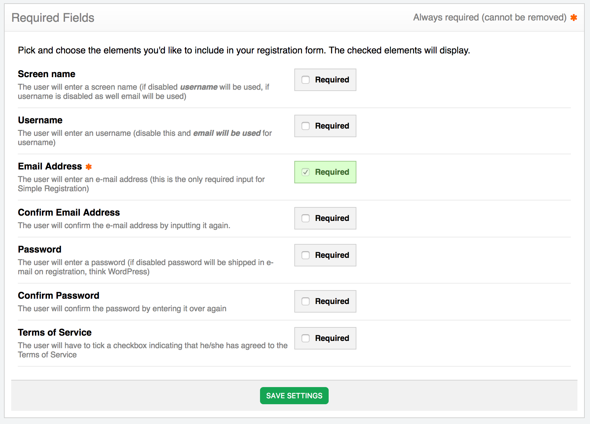

In this section of the settings you specify which fields should be required when a user signs up on your website.

In ExpressionEngine, by default, all these fields are required. If not filled out, the user will get an error message. Simple Registration gives you the freedom to **remove any of these fields** from your signup form.

>>> Note, that since EE requires all of these fields to have values in the database, Simple Registration will populate the disabled fields with user input from other fields. Or, in the case of password for example, auto-generate. This will enable you to have a signup field with only an email address input for instance.

### Screen name

If disabled **username** will be used, if username is disabled as well **email** will be used.

### Username

If disabled email will be used for username.

### Email Address

The user will enter an e-mail address (this is the only required input for Simple Registration).

### Confirm Email Address

If disabled the user won't have to confirm the e-mail address by inputting it a second time (everyone uses auto-fill these days anyway so this seems like a relic from the past)

### Terms of Service

Disable this to have the user auto-accept the terms of service (ie no checkbox in the form).