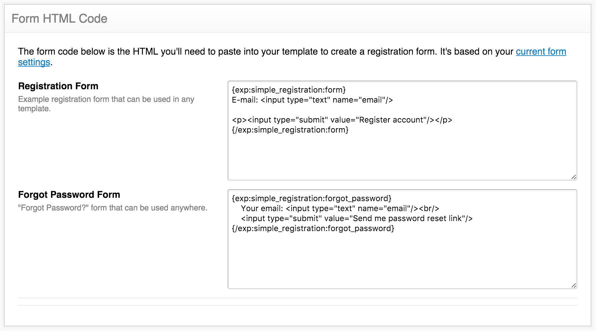

After saving the [Required Fields settings](/simple-registration/configuration/required-fields) you'll be redirected to this page where you can copy a simple example of a signup form and forgotten password form.

The code here is generated using the current member registration settings in ExpressionEngine and Simple Registration (required fields settings).

