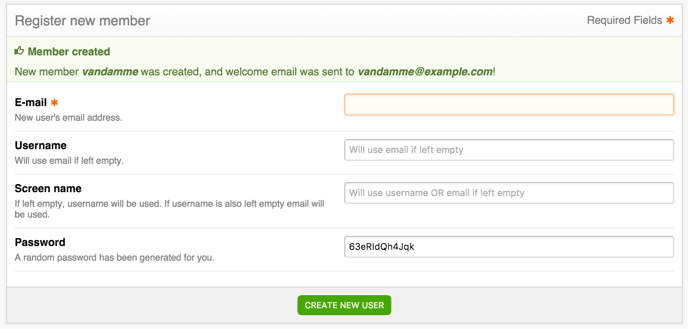

The "Quick Registration" feature in the admin panel enables the administrator to easily register new users **and send out the email** from Simple Registration configured in [the settings](/simple-registration/configuration/settings).

Benefits over standard EE member registration:
* Only need to enter an email to register a new user (password etc. is auto-generated)
* An email can be sent out (with password etc.)